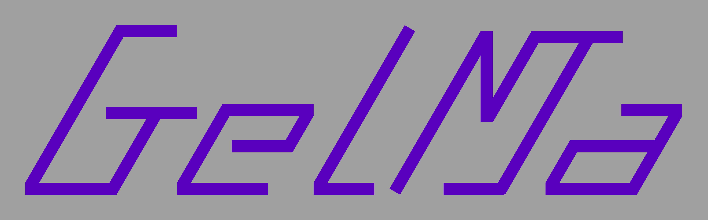

# GelMa


<p align="center">
  
</p>

Copyright (c) 2026 LingXuan-Li

GelMa[ゲルマ] は、古いテレビや類似の表示機器で発生するオーバースキャン問題を補正するために設計された Python アプリケーションです。

モダンな PyQt ベースの GUI を使用して、ユーザーが Web コンテンツを手動で調整し、画面上で実際に表示可能な領域へ収めることができます。

## 主な機能

* オーバースキャンの手動調整
* Web コンテンツ表示の最適化
* モダンな PyQt ベースのグラフィカルインターフェース
* 軽量でシンプルな操作性

## 動作確認環境

### OS および言語

* Windows 11
* Python 3.14

### Python ライブラリ

* PyQt6 6.11.0
* PyQt6-Qt6 6.11.0
* PyQt6-WebEngine 6.11.0
* PyQt6-WebEngine-Qt6 6.11.0
* PyQt6_sip 13.11.1

## 使用方法

### 1. アプリケーションを起動する

```bash
python main.py
```

### 2. ウィンドウ構成

* メイン画面にはコントロールパネルが表示されます。
* サブ画面には Web コンテンツが表示されます（ディスプレイウィンドウ）。

### 3. 言語選択

* コントロールパネル内の言語セレクターを使用して UI 言語を切り替えます。
* 言語を選択すると、インターフェースは即座に更新されます。
* HOME 画面は固定コンテンツで構成されているため、言語変更の影響を受けません。

#### 対応言語

* 英語
* 日本語
* 中国語（簡体字）
* 中国語（繁体字）
* 韓国語
* フランス語
* ドイツ語
* イタリア語
* ロシア語
* ウクライナ語

### 4. オーバースキャンを調整する

* コントロールパネルでオーバースキャンの余白を調整します（マージン / 縦(y軸)スケール / 横(x軸)スケール）。
* 変更内容はリアルタイムで表示ウィンドウに反映されます。

### 5. 表示プレビュー

* 表示ウィンドウには調整後の Web コンテンツが表示されます。
* これにより、古いディスプレイの表示可能領域内にコンテンツを正しく配置できます。

## ライセンス

このプロジェクトは Mozilla Public License 2.0 のもとで公開されています。

## 連絡先 / Contact

- **GitHub**: [](https://github.com/LingXuan-Li)
- **Twitter/X**: [](https://x.com/RaccoonDog_329)

バグ報告は GitHub の [Issues](https://github.com/LingXuan-Li/GelMa/issues) から、質問は Twitter/X の[チャット](https://x.com/RaccoonDog_329) からお願いします。
